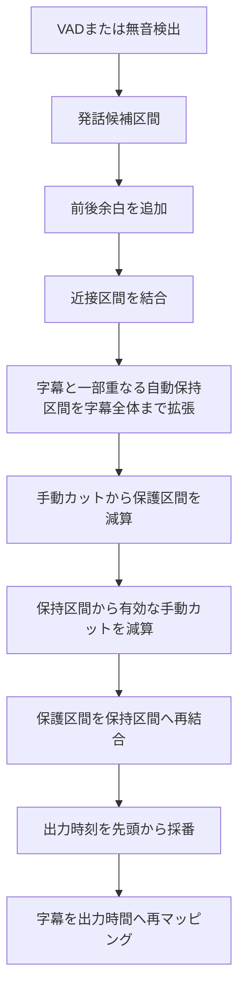

# カット・字幕・再生同期 再利用技術ドキュメント

更新日: 2026-07-19
参照実装: 切り抜き動画工房

## 1. 文書の目的

この文書は、動画のカット、カット後字幕の時間再計算、重複字幕の配置、プレビュー再生と字幕一覧の同期を、他の動画編集プロジェクトへ移植するための技術仕様です。

特定のUIフレームワークには依存しません。処理を次の2層に分けます。

1. 時間軸変換エンジン: カットと字幕時刻を計算する純粋ロジック
2. 表示同期アダプター: video要素、字幕オーバーレイ、字幕一覧を同期するUIロジック

元動画は変更せず、編集結果は `edit_plan.json` 相当の中間データとして保持します。

## 2. 設計上の不変条件

- 元動画時間、処理範囲相対時間、出力動画時間を混同しない。
- カット案を変更するたび、出力動画時間を先頭から再計算する。
- 自動カットと手動カットを区別する。
- 保護区間は手動カットより優先する。
- 自動カットが字幕途中へ入った場合は、字幕に対応する発話全体を保護する。
- 手動カットは最終判断として字幕保護より優先できる。
- 完全に削除された字幕も元時刻と本文を失わない。
- UIの再生同期処理は字幕本文や入力フォーカスを書き換えない。
- SRTは配置情報を持てない。重複字幕の位置制御にはASSまたは独自描画を使う。

## 3. 時間軸

### 3.1 元動画時間

動画ファイル全体を基準にした絶対時刻です。

```text
source_start_sec = 615.0
source_end_sec   = 620.0
```

### 3.2 処理範囲相対時間

ユーザーが選択した処理範囲の開始を0秒にした時刻です。

```text
range_start = 600.0
source_time = 615.0
relative_time = source_time - range_start = 15.0
```

### 3.3 出力動画時間

削除区間を除き、残す区間を連結した動画内の時刻です。

```text
keep 0.0 - 5.0   -> output 0.0 - 5.0
keep 10.0 - 20.0 -> output 5.0 - 15.0
```

元動画相対時刻12.0秒は、出力動画では7.0秒です。

```text
output_time = second_segment.output_start + (12.0 - second_segment.source_start)
            = 5.0 + (12.0 - 10.0)
            = 7.0
```

## 4. 推奨データ構造

### 4.1 残す区間

```json
{
  "id": "seg_0002",
  "enabled": true,
  "range_relative_start_sec": 10.0,
  "range_relative_end_sec": 20.0,
  "output_start_sec": 5.0,
  "output_end_sec": 15.0
}
```

### 4.2 字幕

```json
{
  "id": "sub_0001",
  "enabled": true,
  "text": "字幕本文",
  "range_relative_start_sec": 12.0,
  "range_relative_end_sec": 14.0,
  "source_start_sec": 612.0,
  "source_end_sec": 614.0,
  "output_start_sec": 7.0,
  "output_end_sec": 9.0,
  "split_pieces": []
}
```

### 4.3 カットで完全に除外された字幕

本文と元時刻は残し、出力対象からだけ外します。

```json
{
  "id": "sub_0002",
  "enabled": false,
  "enabled_before_cut": true,
  "disabled_by_cut": true,
  "text": "削除区間内の字幕",
  "range_relative_start_sec": 6.0,
  "range_relative_end_sec": 8.0,
  "output_start_sec": 0.0,
  "output_end_sec": 0.0,
  "split_pieces": []
}
```

`disabled_by_cut` とユーザーが手動で無効化した字幕を区別してください。カットを解除した際、自動無効化された字幕だけを復帰させるために必要です。

## 5. カット案生成の処理順序



重要な優先順位は次の通りです。

```text
保護区間 > 手動カット > 自動字幕保護 > VAD/無音検出
```

自動字幕保護は、VADが字幕の一部を発話として検出している場合だけ字幕全体へ保持区間を広げます。VADと全く重ならない孤立字幕を無条件に残す設計ではありません。これによりWhisperの幻覚字幕がカットを無効化する危険を抑えます。

## 6. 自動カット境界から字幕を保護する

VADの終了が字幕終了より早い場合、そのままカットすると字幕と実際の台詞末尾が消えることがあります。

```python
def extend_keep_ranges(keep_ranges, subtitles):
    expanded = merge_intervals(keep_ranges)
    pending = subtitle_intervals(subtitles)

    while pending:
        remaining = []
        changed = False
        for sub_start, sub_end in pending:
            overlaps = any(
                min(sub_end, keep_end) - max(sub_start, keep_start) > 0.0005
                for keep_start, keep_end in expanded
            )
            if overlaps:
                expanded = merge_intervals(expanded + [(sub_start, sub_end)])
                changed = True
            else:
                remaining.append((sub_start, sub_end))
        if not changed:
            break
        pending = remaining

    return expanded
```

反復処理にしている理由は、字幕Aで保持区間が伸び、その結果として字幕Bとも新たに重なる連鎖を正しく処理するためです。

この拡張処理の後に手動カットを適用してください。順番を逆にすると手動カットが字幕保護で復活します。

## 7. 字幕をカット後時間へ再マッピングする

字幕区間と各保持区間の積集合を求めます。

```python
overlap_start = max(subtitle_start, segment_start)
overlap_end = min(subtitle_end, segment_end)

if overlap_end > overlap_start:
    output_start = segment_output_start + (overlap_start - segment_start)
    output_end = segment_output_start + (overlap_end - segment_start)
```

字幕が複数の保持区間をまたぐ場合は、各積集合を `split_pieces` に記録します。

```json
{
  "split_pieces": [
    {
      "segment_id": "seg_0001",
      "original_start_sec": 4.0,
      "original_end_sec": 5.0,
      "edited_start_sec": 4.0,
      "edited_end_sec": 5.0
    },
    {
      "segment_id": "seg_0002",
      "original_start_sec": 10.0,
      "original_end_sec": 12.0,
      "edited_start_sec": 5.0,
      "edited_end_sec": 7.0
    }
  ]
}
```

少なくとも1区間が残る字幕は有効のまま保持します。

```text
output_start_sec = first_piece.edited_start_sec
output_end_sec   = last_piece.edited_end_sec
```

完全に積集合がない字幕だけを `disabled_by_cut = true` にします。

部分的に切られたことを監査する場合は次を保持します。

```json
{
  "cut_clipped_start": true,
  "cut_clipped_end": false
}
```

## 8. カット変更時の字幕復帰

カットで自動無効化した字幕をそのまま次回入力に使うと、カットを解除しても `enabled = false` が残ります。

再計算の開始時に次を行います。

```python
was_disabled_by_cut = bool(subtitle.get("disabled_by_cut"))
enabled_before_cut = subtitle.get("enabled_before_cut", True)

if was_disabled_by_cut:
    subtitle["enabled"] = enabled_before_cut
```

再マッピング後に映像区間が見つかったら、`disabled_by_cut` と `enabled_before_cut` を削除します。ユーザーが手動で無効化した字幕は自動復帰させません。

## 9. カット字幕の表示切り替え

カット字幕の表示切り替えは編集確認用です。最終出力の有効状態を変更してはいけません。

```javascript
function activeSubtitles(state) {
  const showCut =
    state.showCutSubtitles &&
    state.page === "subtitles" &&
    state.previewMode === "source";

  return state.subtitles.filter((sub) =>
    sub.enabled !== false || (showCut && sub.disabled_by_cut === true)
  );
}
```

- 既定: カット字幕を一覧とプレビューから隠す。
- 表示オン: 元動画プレビューと一覧だけへ戻す。
- カット後プレビュー: 対応する映像がないため表示しない。
- 最終出力: `enabled = false` のまま除外する。

## 10. 重複字幕の安定レーン割り当て

重複字幕を単純に現在件数で並べると、下の字幕が終了した瞬間に上の字幕が移動します。字幕ごとに表示開始時のレーンを固定してください。

### 10.1 割り当てアルゴリズム

1. 字幕を開始時刻、終了時刻、元順序でソートする。
2. 現在字幕の開始以前に終了した字幕をアクティブ集合から外す。
3. アクティブ字幕が使っていない最小レーン番号を選ぶ。
4. 一度割り当てたレーンは字幕終了まで変更しない。

```python
active = []
for subtitle in ordered_subtitles:
    active = [entry for entry in active if entry.end > subtitle.start]
    if active:
        used = {entry.lane for entry in active}
        lane = first_non_negative_integer_not_in(used)
        subtitle.collision_lane = lane
    active.append(subtitle)
```

長い字幕Aが0～10秒、短いBが1～2秒、短いCが3～4秒の場合、Aはレーン0、BとCは空いているレーン1です。終了済みBを使用中レーンとして数えてはいけません。

### 10.2 積み上げ方向

- 下配置: 上方向へ積む。
- 上配置: 下方向へ積む。
- 中央配置: 下方向へ積む。

ASSの基準座標を `base_y`、レーンを `lane`、間隔を `step` とします。

```text
bottom: y = base_y - lane * step
top:    y = base_y + lane * step
middle: y = base_y + lane * step
```

現在実装の目安は次です。

```text
step = max(96px, font_size * 2.8)
```

吹き出し枠は本文より高さが大きいため、次の広めの間隔を使います。

```text
frame_step = max(120px, font_size * 3.0)
```

3件以上が同時表示される場合も、レーン2、3と順番に積みます。画面端を越える場合は座標をクランプするか、フォント縮小、字幕分割、最大同時件数の警告を追加してください。

## 11. 再生位置と字幕の照合

プレビューのモードごとに使用する時刻を切り替えます。

```javascript
function subtitleBounds(subtitle, mode) {
  if (mode === "source") {
    return {
      start: subtitle.range_relative_start_sec,
      end: subtitle.range_relative_end_sec,
    };
  }
  return {
    start: subtitle.output_start_sec,
    end: subtitle.output_end_sec,
  };
}
```

現在時刻 `t` に表示する字幕は次です。

```javascript
const active = subtitles.filter((sub) => {
  const { start, end } = subtitleBounds(sub, mode);
  return sub.enabled && t >= start && t <= end;
});
```

同時字幕へ対応するため、`find()` ではなく `filter()` を使います。

## 12. 字幕一覧の強調と同期スクロール

### 12.1 DOM契約

各字幕行へ安定したIDを付けます。

```html
<div class="subtitle-item" data-subtitle-id="sub_0001"></div>
```

再生中字幕の行へ `playing` クラスと `aria-current` を付けます。

```javascript
const activeIds = new Set(activeSubtitles.map((sub) => sub.id));

list.querySelectorAll(".subtitle-item").forEach((row) => {
  const playing = activeIds.has(row.dataset.subtitleId);
  row.classList.toggle("playing", playing);
  if (playing) row.setAttribute("aria-current", "true");
  else row.removeAttribute("aria-current");
});
```

手動選択の `selected` と再生中の `playing` は別状態にしてください。

### 12.2 スクロール条件

毎フレームスクロールしてはいけません。アクティブ字幕IDの組み合わせが変わったときだけ実行します。

```javascript
const playbackKey = activeSubtitles.map((sub) => sub.id).join("|");
if (playbackKey === previousPlaybackKey) return;
previousPlaybackKey = playbackKey;
```

対象行がすでに一覧内へ見えている場合は動かしません。

```javascript
const listRect = list.getBoundingClientRect();
const rowRect = row.getBoundingClientRect();

const outside = rowRect.top < listRect.top || rowRect.bottom > listRect.bottom;
if (outside) {
  const relativeTop = list.scrollTop + (rowRect.top - listRect.top);
  const targetTop = relativeTop - (list.clientHeight - rowRect.height) / 2;
  list.scrollTo({ top: Math.max(0, targetTop), behavior: "smooth" });
}
```

`offsetTop` の親要素を仮定すると、レイアウト変更で位置計算が壊れます。`getBoundingClientRect()` の差を使う方が安全です。

### 12.3 編集フォーカスを守る

再生同期では次を行わないでください。

- 字幕一覧全体の再描画
- textareaのvalue再代入
- `focus()` の呼び出し
- 再生中字幕を手動選択状態へ上書き

クラスの付け替えとスクロールだけに限定すれば、再生中も字幕本文を編集できます。

## 13. 推奨モジュール分割

```text
timeline/
  intervals.py       区間の正規化・結合・減算
  edit_plan.py       keep_segments生成
  subtitle_map.py    元時刻から出力時刻への変換
  collision.py       重複字幕のレーン割り当て

ui/
  playback_clock.js  video時刻とモード時刻の変換
  subtitle_query.js  現在時刻の字幕検索
  subtitle_overlay.js
  subtitle_list_sync.js
```

時間軸変換関数はファイルI/OやDOMへ依存させず、配列を受け取って配列を返す純粋関数にするとテストと流用が容易です。

## 14. 移植手順

1. 3種類の時間フィールドをデータモデルへ追加する。
2. 区間の `merge`、`subtract`、`intersection` を純粋関数で実装する。
3. 保持区間へ連続した `output_start_sec` と `output_end_sec` を付ける。
4. 字幕と保持区間の積集合から出力時刻を計算する。
5. `disabled_by_cut` と `enabled_before_cut` を追加する。
6. 元動画プレビューとカット後プレビューで時刻参照先を切り替える。
7. 現在時刻の字幕検索を `find` から `filter` へ変更する。
8. 安定レーン割り当てをASS生成とブラウザ表示の両方へ使う。
9. 字幕行へ `data-subtitle-id` を付ける。
10. 再生中クラスと差分スクロールを実装する。
11. カット字幕表示トグルはUIだけへ作用させる。
12. 次節の回帰テストを追加する。

## 15. 必須回帰テスト

### 15.1 カットと字幕

- カット前の字幕時刻が変わらない。
- カット後の字幕が削除秒数ぶん前へ移動する。
- カット内へ完全に入る字幕だけが `disabled_by_cut` になる。
- 字幕先頭だけが切られた場合、残存部分が出力へ残る。
- 字幕末尾だけが切られた場合、残存部分が出力へ残る。
- 字幕が複数保持区間をまたぐ場合、`split_pieces` が複数になる。
- カット解除時、自動無効化字幕が復帰する。
- ユーザーが手動無効化した字幕は勝手に復帰しない。
- 自動カットが字幕途中へ入る場合、字幕全体まで保持区間が伸びる。
- 手動カットは自動字幕保護より優先される。
- 保護区間と手動カットが重なる場合、保護区間以外だけが切られる。

### 15.2 重複字幕

- 下配置は上へ積む。
- 上配置は下へ積む。
- 中央配置は下へ積む。
- 3件同時表示でレーン0、1、2になる。
- 長いAへ短いB、Cが順番に重なる場合、BとCが同じ空きレーンを再利用する。
- 表示途中で字幕レーンが移動しない。
- ASS、装飾枠、ブラウザプレビューの方向が一致する。

### 15.3 一覧同期

- 再生中字幕だけへ `playing` が付く。
- 同時字幕の複数行が強調される。
- 字幕IDが変わらないフレームではスクロールしない。
- 行が表示範囲内ならスクロールしない。
- 行が表示範囲外なら一覧だけがスクロールする。
- スクロール中もtextareaのフォーカスと入力値が維持される。
- カット字幕表示トグルが最終出力の `enabled` を変更しない。

## 16. 現在の参照実装

切り抜き動画工房では、次のファイルが対応します。

- `backend/app/edit_plan.py`
  - `_extend_keep_ranges_for_overlapping_subtitles()`
  - `map_subtitles_to_output()`
  - `build_edit_plan()`
- `backend/app/services.py`
  - `subtitles_with_collision_lanes()`
  - `collision_layout_for_item()`
  - `build_plain_ass()`
  - `build_decoration_ass()`
- `frontend/app.js`
  - `activeSubtitles()`
  - `subtitleBoundsForMode()`
  - `subtitlesWithCollisionLanesForMode()`
  - `subtitlesAtTimelineTime()`
  - `renderSubtitleOverlayStack()`
  - `updateSubtitlePlaybackList()`
- `tests/test_edit_plan_cut_mapping.py`
- `tests/test_ass_subtitle_style.py`
- `tests/check-frontend.ps1`

## 17. 既知の限界

- SRT単体では字幕レーンや位置を表現できない。
- 同時字幕が多すぎる場合、画面内へ収まらない。
- 固定レーン間隔は実フォント、改行数、吹き出し高さにより調整が必要。
- VADと字幕の両方が誤っている場合、自動字幕保護だけでは発話を保証できない。
- 疑似プレビューのシーク精度はブラウザと動画のキーフレームに依存する。
- VFR素材では、抽出音声と映像の時刻基準をFFmpeg側で統一する必要がある。

## 18. AI実装者への要約

この機能を変更するときは、字幕本文ではなく時間軸の不変条件を中心に考えてください。

```text
自動検出でkeepを作る
字幕と一部重なるkeepだけ字幕全体へ拡張する
手動カットと保護を適用する
keepを連結してoutput時間を作る
字幕とkeepの積集合をoutput時間へ写像する
完全削除字幕は本文と元時刻を残してdisabled_by_cutにする
重複字幕は開始時に安定レーンを割り当てる
UIは現在時刻の全字幕を強調し、ID変化時だけ一覧をスクロールする
```

カット、字幕、表示同期を一つの巨大関数へまとめないでください。区間演算、時間変換、字幕検索、DOM同期を分離することで、障害箇所を限定し、他プロジェクトへ再利用できます。
