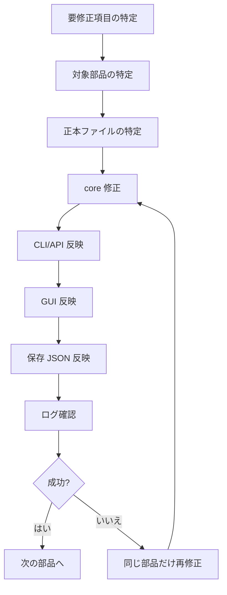

# 切り抜き字幕作成ツール 修正・実装フローチャート

この文書は、既存機能の修正と新規実装を、部品単位で短く回すための実行順を定める。

## 1. 修正方針

- 1 回の作業は 1 部品だけ触る
- 1 回の作業は 1 正本だけ更新する
- GUI、CLI、core を同時に壊さない
- 失敗したら前工程へ戻らず、その部品だけ再実行する
- 不要要素は本体に積まず、別画面・別 JSON・別 preset に逃がす

## 2. 実行順

## 3. 修正の優先順位

1. core の関数
2. CLI / API の入出力
3. GUI のボタンや表示
4. 正本 JSON の保存形式
5. プレビュー
6. 最終出力

## 4. 実装の優先順位

### 第 1 段階: 正本と部品表を固定

- `project.json`
- `edit_plan.json`
- `decoration_project.json`
- `presets/*.json`
- `docs/部品別工程表.md`

### 第 2 段階: コア部品を独立

- `probe`
- `extract-audio`
- `transcribe`
- `detect-silence`
- `detect-vad`
- `build-edit-plan`

### 第 3 段階: 編集補助を独立

- 手動字幕編集
- 手動カット
- 保護区間
- シーン割当
- 字幕編集ページ
- 工程順の画面遷移

### 第 4 段階: 装飾を独立

- テキスト
- 枠
- 文字連動エフェクト
- 画面エフェクト

### 第 5 段階: 出力を独立

- preview
- export
- cleanup

## 5. 再開ルール

作業を再開するときは、次の順に確認する。

1. どの部品を触るか決める
2. その部品の正本を決める
3. その部品の入出力を確認する
4. その部品だけ修正する
5. ログで成功を確認する
6. 次の部品に進む

## 6. 失敗時の戻し方

- 変更した部品以外は戻さない
- プロジェクト全体を巻き戻さない
- 保存 JSON が壊れたら、その JSON だけを再生成する
- プレビューが壊れたら、export まで巻き込まず preview だけ直す

## 7. 実作業の基本ループ

1. 仕様を 1 項目だけ選ぶ
2. 対応する doc を確認する
3. 関連 core / CLI / GUI を確認する
4. 1 箇所だけ修正する
5. ローカルで実行確認する
6. 結果をログかメモに残す
7. 次の 1 項目へ進む

## 8. 参照文書

- `docs/部品単位工程管理ルール.md`
- `docs/部品別工程表.md`
- `docs/アーキテクチャ再設計案.md`
- `docs/実装フローチャート.md`
- `docs/相関関係メモ.md`
