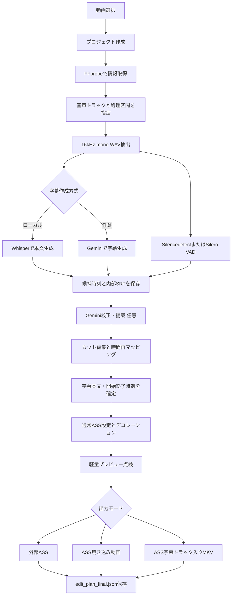

# 切り抜き動画工房 実装フローチャート

## 補足

- すべての編集判断は `edit_plan.json` を中心に行う。
- 元動画は直接編集しない。
- CLI は部品単位の実行器として扱う。
- GUI は CLI と同じコア処理を呼ぶラッパーにする。
- 画面装飾と最終出力の整合性は `decoration_project.json` と `edit_plan.json` を正本にして保つ。
- 工程は長くしない。失敗したら、その部品だけを再実行できる粒度に分ける。
- 画面順は `プロジェクト作成 -> 字幕作成/無音区間 -> Gemini AI編集（任意） -> カット編集 -> 字幕編集 -> デコレーション編集 -> プレビュー点検 -> 動画出力` を基本にする。
- SRTは文字起こし・編集互換用の内部成果物である。通常配布字幕は通常ASSを標準とし、装飾ASSとは分離する。
- 詳細な責務分割は `docs/アーキテクチャ再設計案.md` を参照する。
