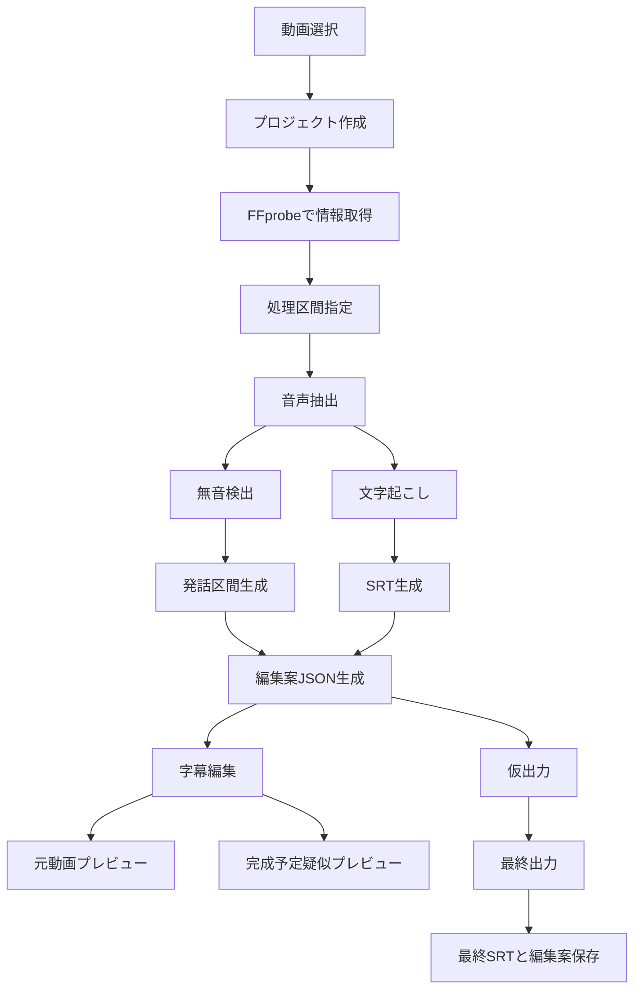

# 切り抜き字幕作成ツール 実装フローチャート

## 補足

- すべての編集判断は `edit_plan.json` を中心に行う。
- 元動画は直接編集しない。
  - CLI では `new-project -> extract-audio -> transcribe -> detect-silence -> create-edit-plan -> preview/export` を順に実行できる。
  - `run-pipeline --config docs/cli-run-pipeline.sample.json` で AI から一括実行できる。
- API でも同じ処理関数を使うため、GUI と CLI の結果差を最小化する。
